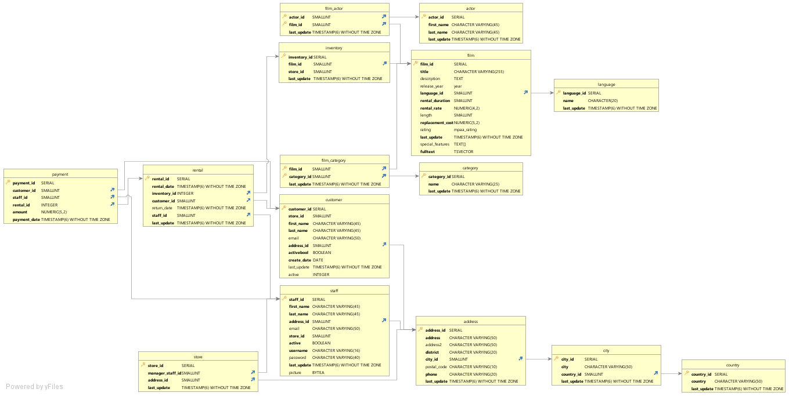
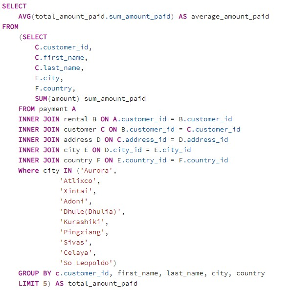
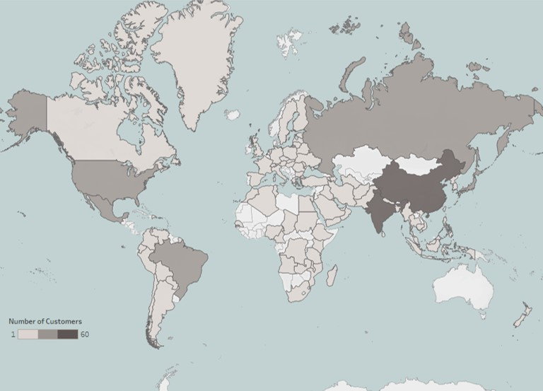
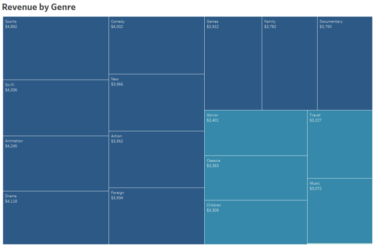
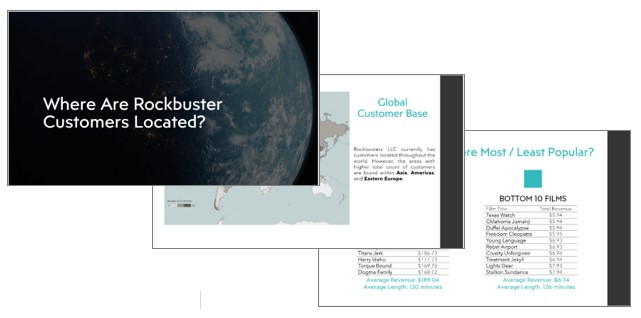
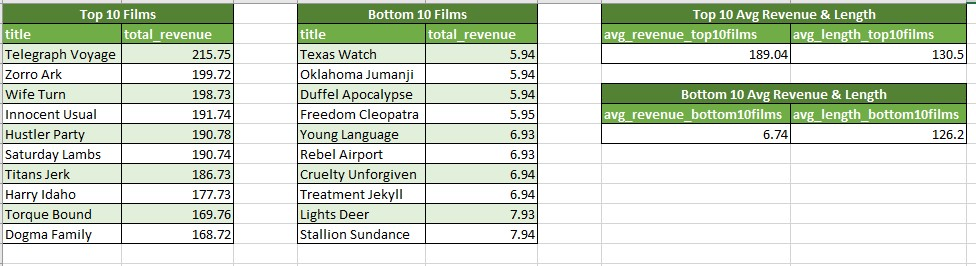
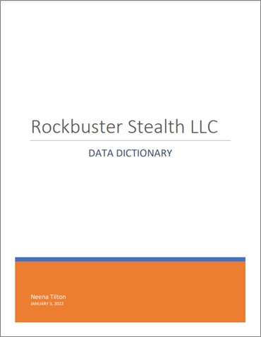

# Rockbuster Stealth Movie Rental Analysis

  

## Background
Rockbuster Stealth LLC is a movie rental company planning to use its existing movie licenses to launch an online video rental service in order to stay competitive against other movie streaming companies, such as Netflix and Amazon. The business intelligence department must gain customer insight and data-driven answers to key business questions to inform their upcoming launch strategy.

## Key Questions
- Which movies contributed the most/least to revenue gain?
- What was the average rental duration for all videos?
- Which countries are Rockbuster customers based in?
- Where are customers with a high lifetime value based?
- Do sales figures vary between geographic regions?

## Tools Used
- **SQL:** the bulk of the analysis was performed using this query language (which retrieves information kept within a database), including data filtering, data cleaning, statistical analysis, joining tables, subquery defining, and using common table expressions (to see specific SQL command lines, click the following: [cleaning](https://github.com/tiltonneena/VideoStoreProject-SQL/blob/main/SQL-DataCleaning), [CTE](https://github.com/tiltonneena/VideoStoreProject-SQL/blob/main/SQL-Top5CTE), and [subqueries](https://github.com/tiltonneena/VideoStoreProject-SQL/blob/main/SQL-SubqueriesTop5)).
- **Tableau:** all data visualizations were created within this software.
- **DbVisualizer:** the entity relationship diagram (ERD) was extracted from the database using this tool that creates a schema of databases. 
- **Other Tools:** PgAdmin4, Microsoft Excel, Microsoft PowerPoint

## Data Source
The data set used for this project is fictional and contains information about the hypothetical company, Rockbuster Stealth LLC. It is around 3MB, containing several files with information on film inventory, customers, and payments, among other things. The data set was loaded into the PostgreSQL database. To see the Rockbuster data set, download [here](https://github.com/tiltonneena/VideoStore---SQL/blob/main/VideoStore%20Dataset.zip).

## Methodology
1.	Before any analysis, the 3 MB data set was loaded into PostgreSQL Database and an entity relationship diagram (ERD) was extracted using DbVisualizer. 
    

      
    

    

      <em>ERD illustrates the links between the tables in a relational database; allowing a quick view of what information each table held and which table to query for specific business questions. </em>
    

 
2.	The data answering specific business questions were accessed using SQL commands in PostgreSQL. Other functions performed using SQL commands include data cleaning, data organizing, drafting summary statistics, and table joining.

    

      
    

    

      <em>SQL query returning average amount spent by the top 5 customers from the highest performing cities. </em>
    

3.	Once all necessary information was collected from the SQL results, they were downloaded as CSV files, and data visualizations of the files were drafted in Tableau for more dynamic evaluation.  
    

      
    

    

      <em>Choropleth map made in Tableau showing existing customer count in each country, with higher counts being depicted by darker colors.</em>
    

    
    

      
    

    

      <em>Treemap chart made in Tableau showing all rentals made categorized by genre.</em>
    

4.	Findings were presented to both technical colleagues and managers in two distinct deliverables. 
- The first deliverable, meant for technical colleagues, was packaged into one document file, which included the full data dictionary and a Excel file containing key SQL queries and outputs used for the analysis. 
- The second deliverable, meant for business managers, was drafted into a final slide show presentation, which narrated the key findings through data visualizations.  

## Key Findings
- As company shifts into online streaming, the analysis found that if they are to funnel their marketing budget countries with the highest sales, the top countries to prioritize are India, China, U.S.A., Japan, and Mexico.
-	On average, most customers made between 25 to 29 rentals, thus, encourage customer loyalty and rental frequency by offering rewards program for customers who make 30+ rentals.
- Average duration of film rentals is 5 days with average rental rate of $2.98.
- The most popular genres were Sports, Sci-Fi, Animation, Drama, and Comedy. The least popular genre was Thriller. 

## Deliverables
For Business Managers - [Final Business Presentation](https://github.com/tiltonneena/VideoStore---SQL/blob/main/PPT%20Presentation.pdf)
    

  

   

For Technical Colleagues - [Analysis Report](https://github.com/tiltonneena/VideoStore---SQL/blob/main/Final%20Excel%20Report.xlsx) & [Data Dictionary](https://github.com/tiltonneena/VideoStore---SQL/blob/main/DataDictionary.pdf) 
    

  

  

 

  

